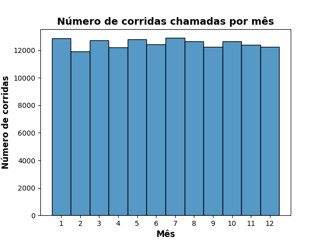
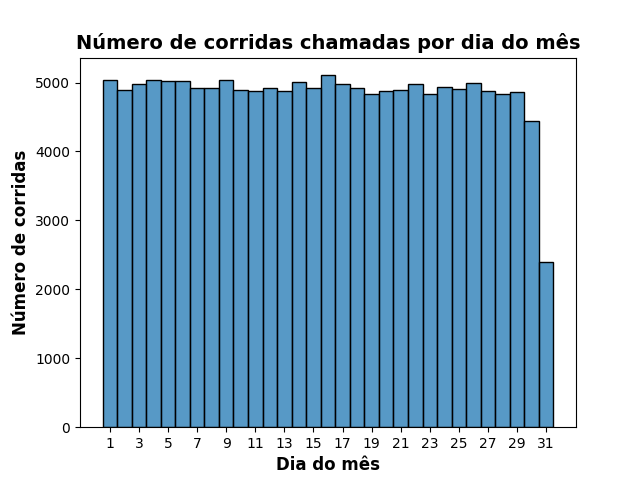
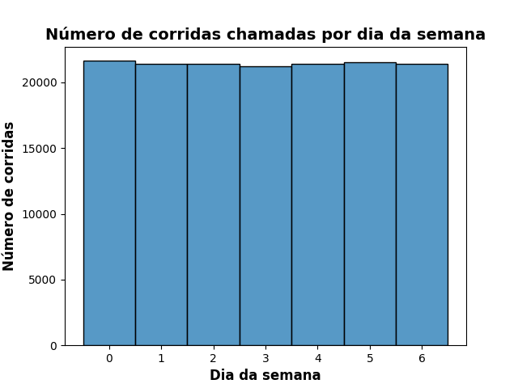
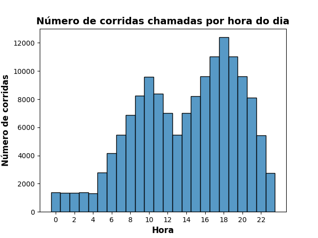
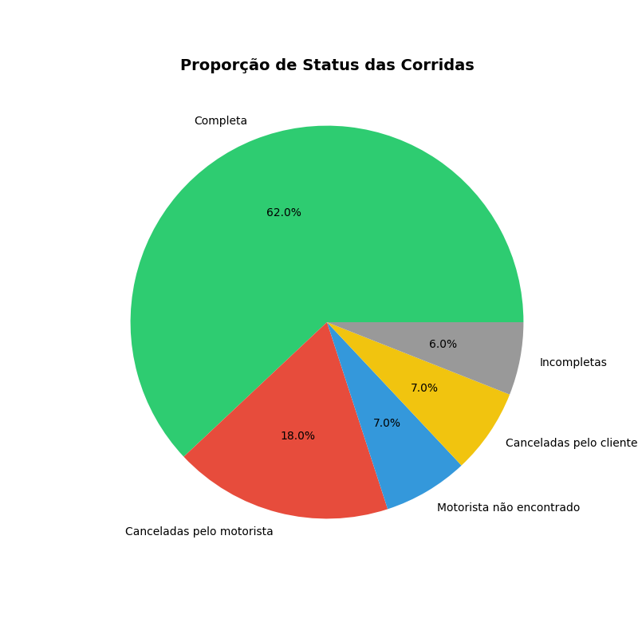
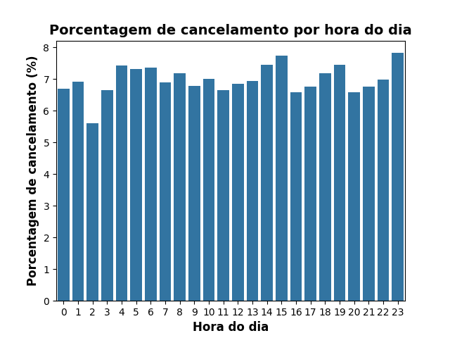
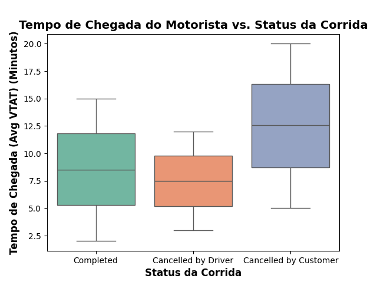
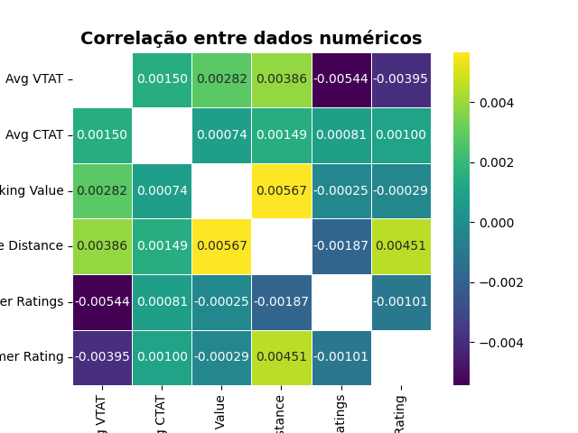

# Análise Exploratória de Dados: Dataset Uber

# Introdução

Este projeto tem como finalidade servir de avaliação como desafio extra para obtenção de pontos para o curso de Introdução à Inteligência Artificial do programa SC TEC.

O objetivo é realizar uma análise exploratória de dados no dataset da Uber disponível na plataforma Kaggle (https://www.kaggle.com/datasets/yashdevladdha/uber-ride-analytics-dashboard/data)

O código foi desenvolvido em um notebook Jupyter localmente.

### Bibliotecas usadas

Foram usadas as seguintes bibliotecas:

- pandas
- matplotlib
- seaborn
- numpy

# Análise

## Análise de distribuição temporal de corridas

Inicialmente deseja-se investigar qual a relação entre o número total de corridas ao longo do tempo. 

Foram analisados os dados mês a mês, ao longo do mês, ao longo da semana e ao longo do dia para investigar se há alguns padrões nos dados.

Antes de usar as datas e horas presentes no dataset, criou-se uma coluna do tipo datetime usando a função do pandas `pd.to_datetime()` para que se possa trabalhar mais facilmente com essa informação.

Para esse tipo de análise, foram gerados gráficos temporais a partir dos dados, mostrados a seguir.

Como os dados do gráfico a seguir são uma agregação e como nem todos os meses tem 31 dias, o comportamento mostrado no gráfico acima é esperado.

No gráfico a seguir, 0 corresponde a segunda-feira e 6 corresponde a domingo.

Percebe-se que as variações a cada mês, ao longo do mês e por dia da semana não são tão relevantes para essa análisa, já que não apresentam um padrão ou uma variação significativa.

Já o gráfico que mostra os dados de número de corridas ao longo do dia parece ser mais interessante por mostrar uma variação intensa e um aumento de procura do serviço em horários específicos (por exemplo às 10 e às 18 horas). Isso poderia ser usado em modelos de aprendizado de máquina para prever preços dinâmicos baseado em horários de pico, por exemplo.

## Análise de cancelamentos

Deseja-se analisar a distribuição de status das corridas em porcentagem. Para isso, como o status é uma coluna categórica e com poucas categorias, optou-se por um gráfico de pizza:

Para verificar se há algum horário em que ocorre maior taxa de cancelamento pelos clientes, foi elaborado um gráfico de percentual de cancelamentos por clientes por hora.

No entanto, como é possível notar no gráfico mostrado a seguir, não há uma relação nítida entre hora e percentual de cancelamentos por clientes, mantendo-se com poucas variações e/ou padrões relevantes:

Para investigar se há alguma relação com a taxa de cancelamentos pelos clientes e o tempo de espera até o motorista chegar no local de partida (coluna `Avg VTAT` do dataset), optou-se por fazer um box plot:

A partir deste box plot é possível ver que em corridas canceladas pelo usuário o tempo médio que o motorista leva para chegar ao local de partida é significativamente mais alto em relação às outras categorias de status (completas e canceladas pelo motorista).

## Correlação entre dados

Para verificar como os dados numéricos se relacionamn entre si, foi usado o método `df.corr()` em um dataframe (considerando apenas as corridas completas) com as colunas numéricas selecionadas: `"Avg VTAT"`, `"Avg CTAT"`, `"Booking Value"`, `"Ride Distance"`, `"Driver Ratings"` e `"Customer Rating"`.

Tendo a matriz de correlação, extraiu-se a diagonal principal para eliminar o fator de correlação 1, já que como os dados tem uma correlação baixa, a correlação unitária de cada coluna com ela mesma afetaria a legenda de cores do mapa de calor a seguir, atrapalhando a correta visualização de possíveis conexões entre os dados.

A partir deste mapa de calor, podemos notar que há uma correlação positiva entre a distância e o valor da corrida, o que é esperado, já que quando maior a distância, maior espera-se que seja o preço da corrida.

Pode-se notar também que há uma correlação negativa entre o tempo que o motorista leva para chegar no local de partida e as avaliações tanto de motoristas quanto de clientes. Isso indica que quanto maior o tempo que motorista leva para chegar até o cliente, maior a tendência de que as avaliação sejam negativas (notas mais baixas tanto para clientes quanto para motoristas).